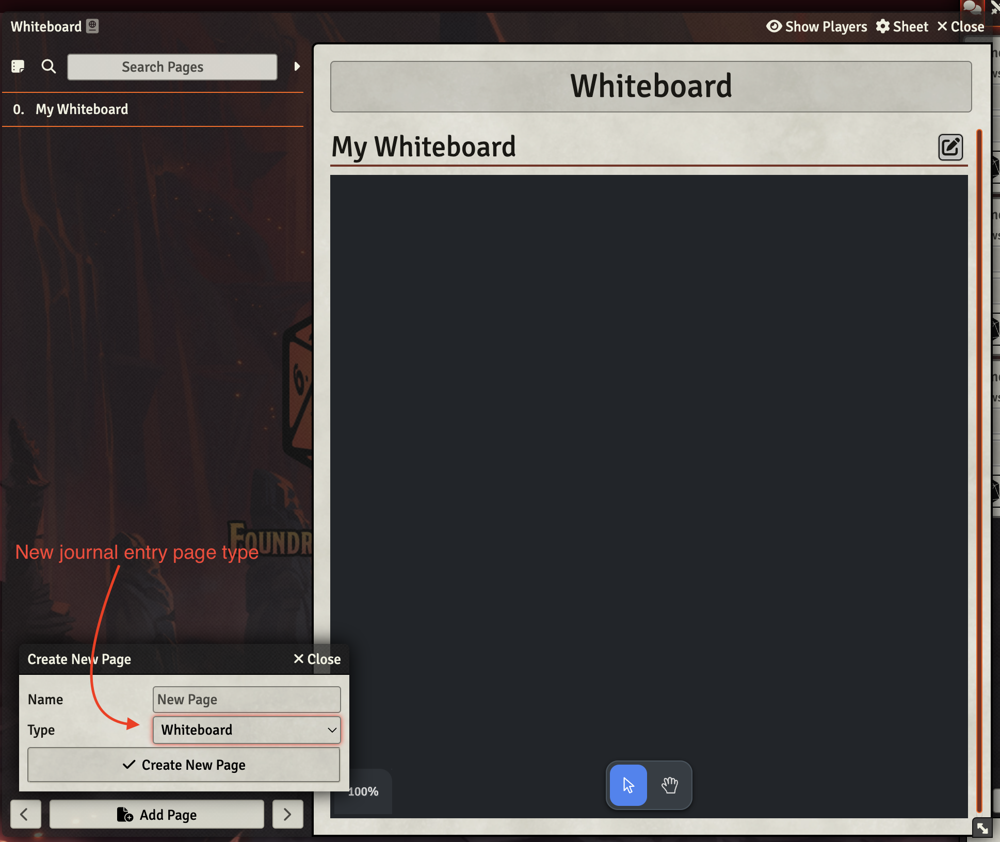
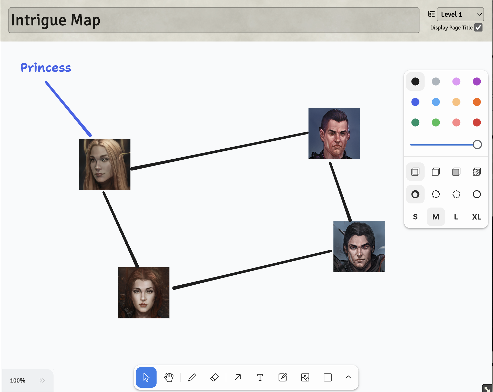
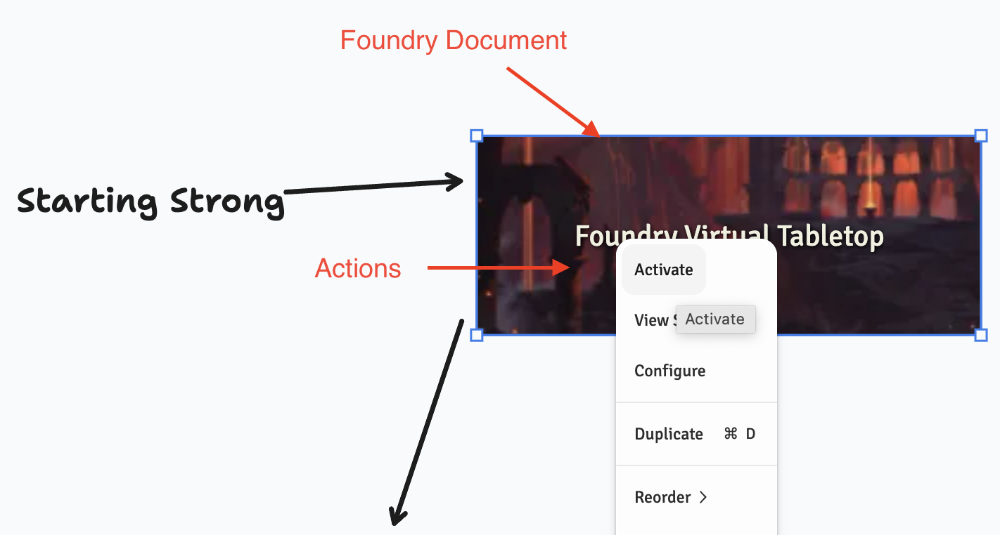

# Journal Whiteboard


[](https://ko-fi.com/darkmoor) [](https://github.com/patrickporto/journal-whiteboard/releases) [](https://github.com/patrickporto/journal-whiteboard/releases)


## About

With the Journal Whiteboard module in Foundry VTT, you can easily create a free-form whiteboard directly on the Journal. If you're a Game Master who doesn't want to rely on third-party software, this tool can be valuable in helping you organize your ideas.

## Screenshots







## Installation

1. Go to the Add-on Modules tab in Foundry Setup
2. Click Install Module
3. In the Manifest URL field paste:
```
https://github.com/patrickporto/journal-whiteboard/releases/latest/download/module.json
```
4. Click Install
5. Launch your world and enable the module in the Game Modules tab of the Configuration and Setup menu.

## Compatibility

| **Module** | **Compatibility** | **Notes** |
|:--- |:---:|:--- |
| [GM Screen](https://foundryvtt.com/packages/gm-screen) | ✔️ | Works as expected |
| [Monk's Enhanced Journal](https://foundryvtt.com/packages/monks-enhanced-journal) | - | Unknown |

## License

This Foundry VTT module, written by Patrick Porto, is licensed under a [MIT License](./LICENSE).
This work is licensed under [Foundry Virtual Tabletop EULA - Limited License Agreement for module development](https://foundryvtt.com/article/license/).
This module is powered by [tldraw](https://github.com/tldraw/tldraw) which is licensed under [Apache License](https://github.com/tldraw/tldraw/blob/main/LICENSE).
